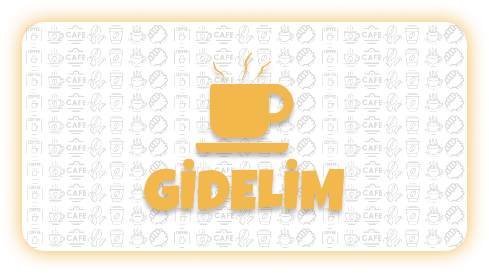

<head></head>
<body>

  
   

 
 
 <h1> Takım Bilgileri </h1>

 <h2>Takım: Flutter 91</h2>
  

  <table>
    <tr>
      <th>Name</th>
      <th>Title</th>
      <th>GitHub</th>
    </tr>
    <tr>
      <td>Sema Erakbıyık</td>
      <td>Scrum Master</td>
      <td>
        
      </td>
    </tr>
    <tr>
      <td>Özgür Boruzancı</td>
      <td>Product Owner</td>
      <td>
        
      </td>
    </tr>
    <tr>
      <td>Özcan Bayram</td>
      <td>Developer</td>
      <td>
        
      </td>
    </tr>
    <tr>
      <td>Sabutay Batuhan Sandalcı</td>
      <td>Developer</td>
      <td>
        
      </td>
    </tr>
    <tr>
      <td>Yasemin Yılmaz</td>
      <td>Developer</td>
      <td>
        
      </td>
  </tr>
  </table>

  

  

  
 <h1> Ürün Bilgileri </h1>

    
  ## Ürün İsmi: GİDELİM
  ### Ürün Açıklaması
  Bir kafe sahibiyseniz fakat işler çok da iyi gitmiyorsa endişelenmeyin, "Gidelim" uygulamasında kolayca kafenizi, menülerinizi ve birbirinden lezzetli ürünlerinizi çok daha geniş kitleler ile 
  paylaşabilirsiniz.   Sizin için bir kafe oluştururken hesabınızı doğrulamanız ve ürünlerinizi özenle eklemeniz için çok rahat bir arayüz tasarladık.   
  Eğer sadece güzel bir mekanda arkadaşlarınızla vakit geçirmek istiyorsanız "Gidelim" uygulaması sayesinde gitmeyi planladığınız kafelerin menülerine ve fiyatlarına önceden erişim sağlayarak size en uygun 
  kafeyi seçebilirsiniz. Aynı zamanda bulunduğunuz konumun yakınındaki kafeleri harita üzerinde görerek yeni kafeler keşfedebilirsiniz.    
  Arkadaşlarınızla bir kafeye gitmeden önce menü ve fiyatları görmek ya da en sevdiğiniz kafenin, bulunduğunuz konuma en yakın şubesini hızlıca görebilmeniz "Gidelim" ile mümkün!   
  Kafelere yorum yapıp puan verebilir ya da en yüksek puanlı kafelere gönül rahatlığıyla gidebilirsiniz. En sevdiğiniz kafeleri favorilerinize ekleyerek uygulama üzerinden rahatça erişebilirsiniz.   
  Gidelim ile müşteriler rahat, kafe sahipleri mutlu! Öyleyse hadi, Gidelim!..

  

  ### Ürün Özellikleri
- Kafe sahiplerinin daha fazla kitleye ulaşmasını sağlamak.
- Kullanıcıların kafelerin menü ve fiyatlarına tek bir uygulama üzerinden ulaşabilmesini sağlamak.
- Bir çok uygulama ve karekod ile yapılan işlemleri tek bir uygulamadan yapmak.
- Zengin menü seçeneğine rahatça ulaşabilmek.
- Kafelere geri bildirim vererek puanlandırmak.
- Kullanıcının bulunduğu konuma en yakın kafe önerisi sunması
- Sevdiğiniz kafenin size en yakın şubesini harita üzerinde görebilmek.
- Konumunuza en yakın kafeleri keşfetmek.

  ### Ürün Hedef Kitlesi
- Kafe işletmesinin daha fazla iş müşteri çekmesini isteyen kafe sahipleri.
- Büyük kafe firmalarının yanında kendi kafesini de öne çıkarmak isteyen kafe işletmeleri.
- Ürünlerini kullanıcılara göstermek isteyen kafeler.
- Gidecekleri mekanın menü ve fiyatları ile ilgili ön bilgi sahibi olmak isteyenler.
- Sevdikleriyle kafede vakit geçirmeyi sevenler.
- Yeni lezzetler ve mekanlar keşfetmek isteyenler.
- Gidecekleri mekan konusunda kararsız olanlar.
  

<h1>Sprint 1</h1>

  
 # Sprint için hedeflenen puan: 100 
 `(100 puan ile tamamlandı)` Toplamda proje boyunca tamamlanması gereken 350 puanlık backlog bulunmaktadır. İlk sprint 100, ikinci sprint 150 ve son sprintte 100 puanı hedeflemekteyiz.

## Daily Scrum
Daily Scrum toplantılarınını whatsapp üzerinden sesli konuşmalarla, anketlerle ve discord üzerinden toplantılar yaparak gerçekleştirdik.Daily Scrum toplantısı örneği jpeg veya word olarak Readme'de tarafımızdan paylaşılmaktadır

# Sprint Review
Başlangıç, hoşgeldin, giriş ve kaydolma ekranları ve ana ekran oluşturuldu. Figma taslağı yapıldı. İsime karar verildi.

# Sprint Retrospective
Daha daha sık toplantılar yapılmasına karar verildi. Görev dağılımının esnek olmasına karar verildi. Harita özelliğini ekleyip çıkarma konusu ikinci sprinte bırakıldı.

<h2>Project Images</h2>

  

</body>
</html>

  <html>
  <head></head>
  <body>
    

    
<h2>Sprint board screenshots</h2>

</body>
</html>

<h1>Sprint 2</h1>

  
 # Sprint için hedeflenen puan: 150
 `(150 puan ile tamamlandı)` Toplamda proje boyunca tamamlanması gereken 350 puanlık backlog bulunmaktadır. İlk sprint 100, ikinci sprint 150 ve son sprintte 100 puanı hedeflemekteyiz. İkinci sprintte 50 puan tasarım, 50 puan kodlama ve 50 puan backlog yönetimi olarak bölüştürülmüştür.

 ## Daily Scrum
Daily Scrum toplantılarınını whatsapp üzerinden sesli konuşmalarla, anketlerle ve çoğunlukla discord üzerinden toplantılar yaparak gerçekleştirdik.Daily Scrum toplantısı örneği jpeg veya word olarak Readme'de tarafımızdan paylaşılmaktadır

# Sprint Review
 Uygulamamız için modern ve kullanıcı dostu bir UI teması ve karşılama ekranları tasarlandı. Firebase ile entegrasyon sağlanarak Kayıt Ol ve Giriş Yap ekranları oluşturuldu. Anasayfa, Kafeler ve Favoriler ekranlarını içeriyor ve alt menü ile bu ekranlar arasında geçiş sağlanıyor.   Firestore Database'den kafelerin isim ve logoları çekilerek listelendi. Kafe detay sayfasında, kullanıcı tıkladığı kafenin detaylarını, en yakın konumlarını ve menü kategorilerini görebiliyor.   Seçilen kafeyi favorilere ekleme butonu eklendi. Ürünler sayfasında, seçilen kategoriye ait ürünler listelendi. Favoriler sayfasında favorilere eklenen kafelerin listesi gösterildi. Menüye Çıkış Yap butonu eklenerek uygulama özelliklerini içeren hedeflerimizi ana hatlarıyla tamamladık.

# Sprint Retrospective
 Bu sprintte ekip arkadaşlarımızla daha sık toplantılar yapmaya özen gösterek yaptığımız işlerde de fikir ayrılığını önelemek açısından birbirimizden geri bildirim alarak ve geri bildirim vererek kararlar netleştirildi.Hedeflerin çoğuna ulaştık ancak veri tabanına ürünlerin ve kategorilerin girilmesi %100 tamamlanmadı, diğer sprinte bırakıldı.

<html>
  <head></head>
  <body>
    

    
<h2>Project Images</h2>

</body>
</html>

  <html>
  <head></head>
  <body>
    

    
<h2>Sprint board screenshots</h2>

</body>
</html>
